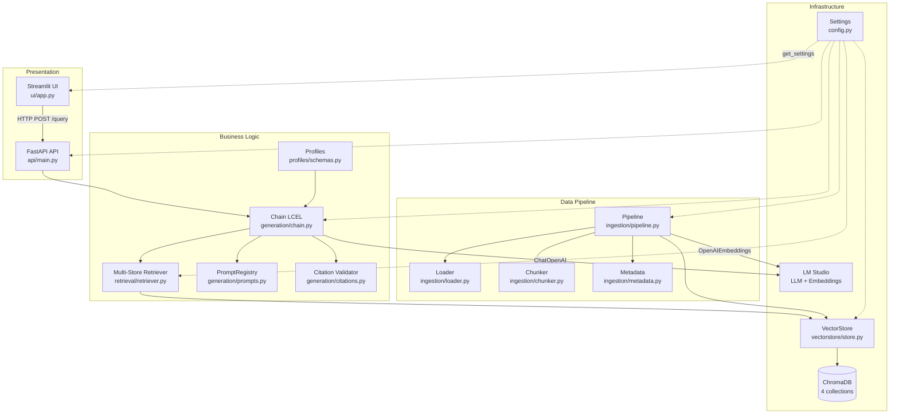

# Architecture

**Pattern:** Modular monolith — single deployable Python package with clearly bounded sub-packages by domain concern. Two deployable units (API container, UI container) share the same codebase, communicate over HTTP.

## High-Level Structure

```
UI (Streamlit) → API (FastAPI) → Chain (LangChain LCEL) → ChromaDB + LM Studio
                                      ↑
                              Pipeline de Ingestão (PDF → chunks → embeddings)
```



## Identified Patterns

### Singleton (Configuration)

**Location:** `src/medasist/config.py:149-163`
**Purpose:** Single `Settings` instance per process via module-level `_settings` cache
**Implementation:** `get_settings()` returns cached instance; all modules import from here

### Singleton (Thread-Safe, Double-Checked Locking)

**Location:** `src/medasist/vectorstore/store.py:24-65`
**Purpose:** Single `chromadb.PersistentClient` per process
**Implementation:** `threading.Lock` with double-checked locking on `_client` + `_client_path`

### LCEL Chain (LangChain Expression Language)

**Location:** `src/medasist/generation/chain.py:135`
**Purpose:** Core RAG pipeline composition
**Implementation:** `chain = prompt | llm | StrOutputParser()` — invoked via `chain.invoke({context, question})`

### Strategy by Enum (Chunking)

**Location:** `src/medasist/ingestion/chunker.py:49-72`
**Purpose:** Different chunking config per DocType
**Implementation:** `getattr(settings, f"chunk_size_{doc_type.value}")` dynamically reads per-type settings; `_SEPARATORS` dict maps DocType to separator lists

### Registry Pattern (Lazy + Thread-Safe)

**Location:** `src/medasist/generation/prompts.py:12-60`
**Purpose:** Cache `ChatPromptTemplate` per `UserProfile` on first access
**Implementation:** `_cache` dict guarded by `threading.Lock`; `get_prompt(profile)` lazily builds from `PROMPT_TEMPLATES` string

### Factory + Closure (Chain Binding)

**Location:** `src/medasist/generation/chain.py:170-200`
**Purpose:** Pre-build chains at startup, bind stores/profile/settings
**Implementation:** `build_chain(stores, profile, settings)` returns `run(question)` closure; stored in `app.state.chains[profile]` at lifespan startup

### Composite Retriever

**Location:** `src/medasist/retrieval/retriever.py:23-52`
**Purpose:** Search across multiple Chroma collections
**Implementation:** `_MultiStoreRetriever(BaseRetriever)` aggregates results from all DocType stores; delegates to module-level `retrieve()` function

### DTO Mapping (Pydantic)

**Location:** `src/medasist/api/schemas.py:56-121`
**Purpose:** Convert internal dataclasses to API response DTOs
**Implementation:** `@classmethod from_result(GenerationResult)` and `from_item(CitationItem)` — explicit conversion keeping internal models framework-agnostic

### Idempotency via Content Hashing

**Location:** `src/medasist/ingestion/pipeline.py:84-86`
**Purpose:** Prevent re-ingestion of duplicate documents
**Implementation:** SHA-256 of PDF file computed in `loader.py`; `_already_indexed()` checks `collection.get(where={"sha256": ...})`

### Guard Clauses / Short-Circuit (Cold Start)

**Location:** `src/medasist/generation/chain.py:107-118`, `src/medasist/retrieval/retriever.py:84-170`
**Purpose:** Zero-cost, zero-hallucination fallback when no relevant chunks found
**Implementation:** Retriever returns `[]` when no chunks exceed score threshold; chain checks `if not docs:` → returns fixed message without calling LLM

### Dependency Injection via Parameters

**Location:** Throughout all modules
**Purpose:** Testability with fake embeddings and EphemeralClient
**Implementation:** Most functions accept `settings: Settings`, `chroma_client`, `embed_fn`, or `stores` as explicit parameters; hybrid pattern allows `settings: Settings | None = None` with `get_settings()` fallback

## Data Flow

### Ingestion Flow

```
PDF file (data/raw/{type}/*.pdf)
  │
  ▼
ingest_directory(dir, doc_type, chroma_client, settings, embed_fn)
  │  per PDF:
  ▼
ingest_document(path, doc_type, ...)
  │
  ├─► loader.py: load_pdf(path, doc_type)
  │     pdfplumber (primary) → PyMuPDF (per-page fallback)
  │     → LoadedDocument{path, doc_type, sha256, pages[]}
  │
  ├─► _already_indexed(collection, sha256)?
  │     YES → IngestionResult(skipped=True)  ◄── idempotency
  │     NO  ↓
  │
  ├─► chunker.py: chunk_document(doc, settings)
  │     RecursiveCharacterTextSplitter(config per DocType)
  │     → list[TextChunk] (filters < 50 chars)
  │
  ├─► metadata.py: build_metadata_batch(chunks)
  │     → list[ChunkMetadata]
  │
  ├─► embed_fn(texts) → embeddings (via LM Studio)
  │
  └─► collection.upsert(ids, embeddings, documents, metadatas)
       → ChromaDB persistent collection (one per DocType)
       → IngestionResult{chunks_indexed, sha256, skipped, error?}
```

Key: idempotent (SHA-256), per-DocType collection routing, resilient (errors captured in `IngestionResult`, never raised; partial failures don't abort batch).

### Query Flow

```
User types question in Streamlit UI
  │
  ▼
ui/app.py → ui/client.py: query()  ──HTTP POST──►  /query
  │
  ▼
api/routers/query.py: chain = app.state.chains[body.profile]
                     result = chain(body.question)
  │
  ▼
generation/chain.py: run_query(question, stores, profile, settings)
  │
  ├─► build_retriever(stores, settings) → _MultiStoreRetriever
  │    retriever.invoke(question)
  │
  ├─► retrieval/retriever.py: retrieve(query, stores, settings)
  │    For each (DocType, Chroma store):
  │      store.similarity_search_with_score(query, k=top_k)
  │      Filter: score <= retrieval_score_threshold (L2 distance)
  │    Deduplicate by page_content, sort by distance, take top_k
  │    → list[Document] (empty if cold start)
  │
  ├─► COLD START (docs empty)
  │    return GenerationResult(
  │      answer=cold_start_message, citations=[],
  │      is_cold_start=True)  ◄── LLM never called
  │
  └─► NORMAL PATH
       build_citations(docs) → [CitationItem]
       _format_context(docs) → "[1] ...\n[2] ..."
       prompt = PromptRegistry.get_prompt(profile)
       llm = ChatOpenAI(temp, max_tokens from ProfileConfig)
       chain = prompt | llm | StrOutputParser()
       raw = chain.invoke({context, question})
       validate_citations(raw, citations)
         → remove hallucinated [N] markers
         → keep only cited CitationItems
       if no valid citations → cold start fallback
       return GenerationResult(...)
  │
  ▼
api/schemas.py: QueryResponse.from_result(result) → JSON response
  │
  ▼
ui/client.py: parse → QueryResult
ui/app.py: _render_response(result)
  if cold_start → st.warning() + st.info(disclaimer)
  else → st.markdown(answer) + expander with citations + st.caption(disclaimer)
```

### API Warm-Up (Lifespan)

**Location:** `src/medasist/api/main.py:26-49`

At startup:
1. `get_settings()` — load settings singleton
2. `get_client(settings)` — init ChromaDB PersistentClient (thread-safe)
3. `build_embeddings(settings)` — build OpenAIEmbeddings -> LM Studio
4. `get_all_vectorstores(client, embeddings, settings)` — open/create all 4 collections
5. Build one chain per UserProfile (4 total) — each is a closure
6. Store in `app.state.chains` — per-request handler does O(1) dict lookup

No cleanup on shutdown (ChromaDB persists to disk).

## Code Organization

**Approach:** Feature/domain-based with layer-like internal structure

| Package | Domain Concern | Layer Role |
|---------|---------------|------------|
| `ingestion/` | Document ETL pipeline | Data pipeline |
| `vectorstore/` | Vector storage abstraction | Infrastructure |
| `retrieval/` | Search & filtering | Infrastructure / service |
| `generation/` | LLM orchestration, prompts, citations | Service / business logic |
| `profiles/` | User role configuration | Configuration / domain |
| `api/` | HTTP interface & DTOs | Presentation |
| `ui/` | Streamlit frontend | Presentation |
| `config.py` | Central configuration | Cross-cutting |

**Module boundaries:** Modules communicate via direct function calls with explicit parameter passing. No event buses, message queues, or pub/sub. The `Settings` object is the shared dependency injected everywhere. The only async boundary is the HTTP call between UI and API.

## Key Abstractions

| Abstraction | Location | Role |
|-------------|----------|------|
| `DocType` (str Enum) | `ingestion/schemas.py:8` | Discriminator for collection, chunking, metadata |
| `UserProfile` (str Enum) | `profiles/schemas.py:12` | Discriminator for prompt, temperature, max_tokens |
| `LoadedDocument` / `PageContent` | `ingestion/schemas.py:21,37` | Immutable PDF content carriers |
| `TextChunk` | `ingestion/chunker.py:24` | Immutable chunk with provenance |
| `ChunkMetadata` | `ingestion/metadata.py:11` | Serializable metadata for ChromaDB |
| `CitationItem` | `generation/citations.py:12` | Source reference tied to `[N]` marker |
| `GenerationResult` | `generation/chain.py:27` | Complete RAG result (answer, citations, profile, disclaimer, is_cold_start) |
| `ProfileConfig` | `profiles/schemas.py:66` | Immutable LLM config per profile |
| `EmbedFn` (type alias) | `ingestion/pipeline.py:18` | `Callable[[list[str]], list[list[float]]]` |
| `_MultiStoreRetriever` | `retrieval/retriever.py:23` | LangChain `BaseRetriever` implementation |
| `QueryRequest` / `QueryResponse` | `api/schemas.py` | API DTOs (Pydantic) |

## Separation of Concerns

| Boundary | Enforced By |
|----------|-------------|
| UI never touches LLM/ChromaDB | `ui/app.py` only imports `ui/client.py` (httpx) — no langchain/chromadb/openai |
| API DTOs vs. internal models | `api/schemas.py` with `from_result()` / `from_item()` conversion |
| Ingestion vs. retrieval | Separate packages; ingestion writes via raw chromadb client, retrieval reads via langchain_chroma.Chroma |
| Configuration vs. logic | All values flow through `Settings`; no module hardcodes paths, model names, or thresholds |
| Prompt templates vs. construction | `profiles/schemas.py` holds template strings; `generation/prompts.py` converts to ChatPromptTemplate lazily |

## API Endpoints

| Method | Path | Rate limit | Auth | Purpose |
|--------|------|------------|------|---------|
| GET | `/health` | — | — | Health check (`{"status": "ok"}`) |
| POST | `/query` | 10/minute | — | RAG query (`QueryRequest` -> `QueryResponse`) |
| POST | `/ingest` | 5/minute | `X-Admin-Key` header | PDF ingestion (`UploadFile` + `doc_type` -> `IngestResponse`) |
