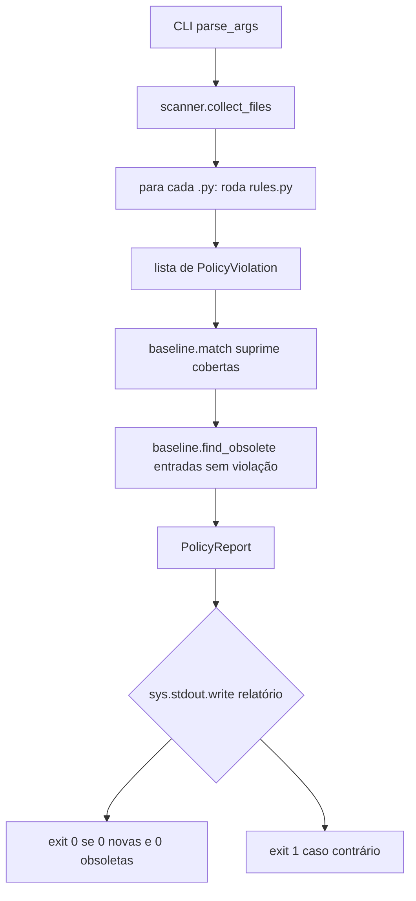

# Policy-as-Code — Design

**Spec:** `.specs/features/policy-as-code/spec.md`
**Status:** Awaiting human approval

---

## Architecture Overview

Um policy checker **stdlib-only** em Python 3.11, espelhando o padrão do módulo `src/medasist/evaluation/` + `scripts/evaluate_rag.py` + `tests/evaluation/` + `tests/scripts/test_evaluate_rag.py`:

```
scripts/policy_check.py (CLI thin: parse_args/main/sys.exit)
        │  chama
        ▼
src/medasist/policies/
├── report.py    → PolicyViolation, PolicyReport (frozen dataclasses)
├── baseline.py  → BaselineEntry, load/save policies.toml, match, obsoletas
├── rules.py     → rule-checkers puros: arquivo → list[PolicyViolation]
└── scanner.py   → traversal (src/tests/scripts + exclusões), orquestra rules + baseline

policies.toml (raiz) ← baseline/allowlist lida por baseline.py
.github/workflows/ci.yml → step "Policy check" (python scripts/policy_check.py src tests scripts)
.pre-commit-config.yaml  → hooks locais black/ruff/policy/pytest
```

Fluxo de dados do scan:



Cada regra é uma **função pura** `check(texto, path, context) -> list[PolicyViolation]` — sem IO, sem estado global → testável em isolamento e paralelizável. O scanner faz o único IO (leitura de arquivos, baseline).

## Code Reuse Analysis

### Existing Components to Leverage

| Component | Location | How to Use |
|-----------|----------|------------|
| Padrão de módulo `evaluation/` + script `evaluate_rag.py` | `src/medasist/evaluation/`, `scripts/evaluate_rag.py` | Espelhar layout: pacote `src/medasist/policies/`, CLI `scripts/policy_check.py`, testes `tests/policies/` + `tests/scripts/test_policy_check.py` |
| Padrão de CLI `parse_args(argv) / main(argv) -> int` | `scripts/evaluate_rag.py:33,287`, `scripts/ingest_docs.py:19,58` | Mesmo contrato testável via `from policy_check import main` (pythonpath `["src","scripts"]`) |
| Frozen dataclasses para value objects | `src/medasist/ingestion/schemas.py`, `profiles/schemas.py` (10 ocorrências) | `PolicyViolation`, `PolicyReport`, `BaselineEntry` como `@dataclass(frozen=True)` |
| Convenções de logging `%s` lazy | Todo `src/` | `logger = logging.getLogger(__name__)` e `logger.error("...%s", ...)` no CLI para erros fatais |
| Testes de script com `capsys` | `tests/scripts/test_evaluate_rag.py:145-209` | Mesmo padrão para o relatório do CLI e para o contrato AC-18 |
| `pythonpath = ["src", "scripts"]` | `pyproject.toml:48` | Testes importam `from policy_check import ...` e `from medasist.policies...` sem sys.path manual |

### Integration Points

| System | Integration Method |
|--------|--------------------|
| CI (`ci.yml`) | Novo step entre "Lint (ruff check)" e "Testes": `python scripts/policy_check.py src tests scripts`. `deploy.yml` **não** muda (AC-21). |
| pre-commit | `.pre-commit-config.yaml` com `repo: local`, `language: system`, `pass_filenames: false` para policy/pytest. |
| `policies.toml` | Lido por `baseline.py` via `tomllib` (stdlib); escrito pelo gerador `--baseline-generate` com serializador interno. |
| GitHub PR | `.github/pull_request_template.md` auto-aplicado (AC-22). |

## Components

### `report.py`

- **Purpose**: Define os value objects do relatório de política.
- **Location**: `src/medasist/policies/report.py`
- **Interfaces**:
  - `@dataclass(frozen=True) PolicyViolation` — `rule_id: str`, `path: str`, `line: int`, `message: str`, `baseline: bool = False`, `symbol: str | None = None`.
  - `@dataclass(frozen=True) PolicyReport` — `violations: tuple[PolicyViolation, ...]`, `baseline_entries: tuple[BaselineEntry, ...]` (de `baseline.py`), `obsolete_entries: tuple[BaselineEntry, ...]`, `files_scanned: int`, `files_skipped: int`; propriedades: `new_violations` (baseline=False), `baselined_violations`, `total_violations`, `has_failures` (new_violations or obsolete_entries não-vazios).
- **Dependencies**: `baseline.py` (tipos), `__future__`, `dataclasses`.
- **Reuses**: Padrão frozen dataclass do repositório.

### `baseline.py`

- **Purpose**: Modelo e IO da baseline/allowlist em `policies.toml`.
- **Location**: `src/medasist/policies/baseline.py`
- **Interfaces**:
  - `@dataclass(frozen=True) BaselineEntry` — `rule_id: str`, `path: str` (relativo, POSIX), `location: str`, `reason: str`, `active: bool = True`.
  - `load_baseline(path: Path) -> tuple[BaselineEntry, ...]` — lê TOML com `tomllib`; arquivo ausente → tupla vazia (sem erro).
  - `save_baseline(path: Path, entries: Sequence[BaselineEntry]) -> None` — serializador TOML interno mínimo (escape de `\` e `"`; campos controlados pelo gerador), usado apenas por `--baseline-generate`.
  - `match(baseline, rule_id, path, location) -> BaselineEntry | None` — chave `(rule_id, path_normalizado, location)`; entradas `active=False` nunca suprimem.
  - `find_obsolete(violations, entries, files_scanned) -> tuple[BaselineEntry, ...]` — entrada ativa sem violação correspondente no scan atual (inclui arquivo deletado/fora da varredura) → obsoleta.
  - `normalize_path(p: Path) -> str` — relativo à raiz + separadores POSIX (Windows `\` → `/`).
- **Dependencies**: `pathlib`, `tomllib`, `report.py`.
- **Reuses**: `Path` conventions do repositório.

### `rules.py`

- **Purpose**: Regras estáticas — uma função pura por regra.
- **Location**: `src/medasist/policies/rules.py`
- **Interfaces** — todas `check(text: str, path: str, root: Path) -> list[PolicyViolation]` (assinatura única; `root` usado só para contextos de caminho):
  - `check_future_import(text, path, root)` — **REQ-POL-03/07/20** (AST): primeiro statement executável deve ser `from __future__ import annotations`; docstring de módulo (primeiro `Expr` string) pode preceder; vazio / `__init__.py` sem conteúdo executável → isento; comentários ignorados (AST).
  - `check_pathlib(text, path, root)` — **REQ-POL-08**: flagga string literal que (a) é primeiro argumento de chamada `open(...)`, ou (b) contém separador de path (`/` ou `\`), ou (c) termina com extensão conhecida (`.pdf .json .toml .md .txt .csv .log .py .lock .env .example`) — exceto se estiver dentro de `Path(...)` ou `str(...)`, for docstring de módulo, URL (`://`) ou placeholder de formatação. Constante `_PATH_EXTENSIONS` central.
  - `check_no_print(text, path, root)` — **REQ-POL-09/18**: AST — chamada `print(...)` (func `Name` "print") → violação; suppress se `(path, símbolo_enclosing)` na allowlist de print; símbolo = função/classe que envolve a chamada (ou `"<module>"`); `sys.stdout.write`/`logger.*` não são flaggados.
  - `check_logger(text, path, root)` — **REQ-POL-10**: módulos sob raiz `src/` com conteúdo executável precisam de atribuição módulo-nível `logger = logging.getLogger(__name__)` (AST `Assign` com `Name logger` e call `logging.getLogger`); `__init__.py` vazio/comment-only isento (consistente com OQ-02).
  - `check_docstring(text, path, root)` — **REQ-POL-11/20**: símbolos **públicos** (top-level ou métodos, nome sem `_` inicial e não-dunder) precisam de docstring (primeiro statement do corpo é string `Expr`); privados/dunders/vazios isentos. Validação de **presença**; estilo NumPy completo (seções) fica como melhoria futura documentada.
  - `check_complexity(text, path, root)` — **REQ-POL-12/19**: três sub-checks no mesmo módulo:
    - `FUNC-LENGTH`: span físico do `def` (linha do `def` até a última linha do corpo dedentada), inclusivo; viola se `> 50`.
    - `NESTING-DEPTH`: profundidade de blocos compostos (`if/for/while/try/with/match` + `except/finally/else/elif/case`) por statement dentro de cada função; viola se `> 4`.
    - `FILE-LENGTH`: linhas físicas do arquivo; viola se `> 800`.
    - Limites **inclusivos**: 50, 4, 800 passam; 51, 5, 801 violam.
  - `check_patient_data(text, path, root)` — **REQ-POL-13**: regex estáticos (ver seção "Design do regex de dado de paciente"); match fora da allowlist de tokens → violação com linha e padrão casado.
  - `RULE_REGISTRY: tuple[RuleChecker, ...]` — lista ordenada de `(rule_id, check)` usada pelo scanner (fonte única para relatórios/baseline).
- **Dependencies**: `ast`, `re`, `pathlib`, `report.py`. **Zero dependências de terceiros.**
- **Reuses**: convenções de AST/typing do código-base (PEP 604/585, `from __future__ import annotations`).

### `scanner.py`

- **Purpose**: Coleta de arquivos + orquestração rules → baseline → report.
- **Location**: `src/medasist/policies/scanner.py`
- **Interfaces**:
  - `DEFAULT_ROOTS = ("src", "tests", "scripts")` — OQ-08.
  - `DEFAULT_EXCLUDES = (".opencode", ".agents", ".git", "data", "evals", "chroma_db", "logs", "docs", "node_modules")` + padrões `*.lock`, `__pycache__`, diretórios ocultos (`.`) — OQ-08.
  - `collect_files(roots, excludes) -> list[Path]` — `rglob("*.py")` (e `*.pyi`? **não** — só `.py`), pulando qualquer segmento de path em excludes; nunca cruza para fora do root.
  - `run_scan(roots, excludes, baseline_path) -> PolicyReport` — por arquivo: `read_text(encoding="utf-8", newline="")` → `splitlines()` (CRLF-safe) → cada rule do registry → `baseline.match` → coleta; depois `find_obsolete`.
  - `generate_baseline(roots, excludes) -> tuple[BaselineEntry, ...]` — roda as regras sem baseline e emite entradas ativas (usado por `--baseline-generate`).
- **Dependencies**: `pathlib`, `rules.py`, `baseline.py`, `report.py`.
- **Reuses**: `Path.rglob`, `Path.read_text`.

### `scripts/policy_check.py`

- **Purpose**: CLI thin (padrão `evaluate_rag.py`).
- **Location**: `scripts/policy_check.py`
- **Interfaces**:
  - Bootstrap `sys.path` no topo (após `from __future__ import annotations`): `sys.path.insert(0, str(Path(__file__).resolve().parents[1] / "src"))` → importa `medasist.policies.*` sem depender de instalação do pacote (crítico no CI que só instala `requirements.lock`).
  - `parse_args(argv: list[str] | None = None) -> argparse.Namespace` — posicionais `paths` (default `["src","tests","scripts"]`), `--exclude` (nargs `+`, extra), `--baseline` (default `policies.toml`), `--baseline-generate [PATH]` (dev: grava baseline das violações atuais e exit 0).
  - `main(argv: list[str] | None = None) -> int` — 0 conforme / 1 violações novas ou baseline obsoleta; erros fatais → `logger.error` + 1.
  - `_render(report) -> str` — relatório legível (regra, arquivo, local, mensagem; contagem baselinada vs nova; lista de obsoletas) emitido via **`sys.stdout.write`** (não `print()`) para não auto-violar NO-PRINT.
  - `if __name__ == "__main__": sys.exit(main())`.
- **Dependencies**: `argparse`, `sys`, `logging`, `medasist.policies.*`.
- **Reuses**: contrato `parse_args/main` dos scripts existentes.

### `.pre-commit-config.yaml`

- **Purpose**: Hooks locais (OQ-04) — `repo: local`, `language: system` (usa o venv ativo com versões pinadas), `pass_filenames: false` para policy/pytest.
- **Hooks** (ordem): `black` (`black --check src/ tests/ scripts/`) → `ruff` (`ruff check src/ tests/ scripts/`) → `medasist-policy` (`python scripts/policy_check.py src tests scripts`) → `pytest` (`pytest`). Todos `types: [python]` exceto policy/pytest (`pass_filenames: false`).
- **Fallback documentado**: `python -m pre-commit run --all-files` (Windows/pwsh).
- **Gotcha documentado**: `.env` local com linhas de comentário com valor quebra o pytest → rodar hooks com `.env` movido (mesmo procedimento da suíte local, CONTEXT.md).

### CI step (`ci.yml`)

Entre "Lint (ruff check)" e "Testes":

```yaml
- name: Policy check (convenções AGENTS.md + regras de segurança)
  run: python scripts/policy_check.py src tests scripts
```

Sem novas dependências no CI (stdlib-only; bootstrap de `sys.path` no script). `deploy.yml` intocado (AC-21).

## Data Models

### PolicyViolation

```python
@dataclass(frozen=True)
class PolicyViolation:
    rule_id: str      # ex.: "FUNC-LENGTH", "PATIENT-DATA", "NO-PRINT"
    path: str         # relativo à raiz, separadores POSIX
    line: int         # 1-based, física (CRLF normalizado)
    message: str      # descrição em PT-BR com evidência
    baseline: bool    # True se suprimida por entrada de baseline
    symbol: str | None = None  # nome do símbolo quando aplicável
```

### PolicyReport

```python
@dataclass(frozen=True)
class PolicyReport:
    violations: tuple[PolicyViolation, ...]
    baseline_entries: tuple[BaselineEntry, ...]
    obsolete_entries: tuple[BaselineEntry, ...]
    files_scanned: int
    files_skipped: int
    # property: new_violations, baselined_violations, total_violations, has_failures
```

### BaselineEntry

```python
@dataclass(frozen=True)
class BaselineEntry:
    rule_id: str    # ex.: "FUNC-LENGTH", "NO-PRINT"
    path: str       # relativo, POSIX
    location: str   # símbolo (FUNC-LENGTH/NESTING/NO-PRINT) | linha (PATIENT-DATA/PATHLIB) | "<file>" (FILE-LENGTH)
    reason: str     # motivo (ex.: "débito AD-005")
    active: bool = True
```

**Storage — `policies.toml` (decisão):** arquivo dedicado na raiz, em vez de `[tool.medasist.policies]` no `pyproject.toml`. **Justificativa:** (1) a baseline é um allowlist volátil que muda a cada correção incremental de débito (OQ-01) — churn de diff não polui as seções `[tool.pytest]`/`[tool.ruff]`/`[tool.black]` nem cria conflitos de merge com outras ferramentas; (2) permite regravação integral e segura pelo `--baseline-generate` sem risco de clobber de configuração de build/lint; (3) leitura com `tomllib` (stdlib 3.11) — zero deps; escrita via serializador interno mínimo controlado pelo gerador.

Formato:

```toml
# Baseline do policy checker (gerado por: python scripts/policy_check.py --baseline-generate)
# Remove entradas conforme o débito é pago (AC-15 exige limpeza de obsoletas).

[[entries]]
rule_id = "FUNC-LENGTH"
path = "src/medasist/generation/chain.py"
location = "_run_single"
reason = "débito AD-005 (função >50 linhas pré-existente)"

[[entries]]
rule_id = "FUNC-LENGTH"
path = "src/medasist/generation/chain.py"
location = "_merge_sub_results"
reason = "débito AD-005"

[[entries]]
rule_id = "FUNC-LENGTH"
path = "src/medasist/generation/chain.py"
location = "_stream_single"
reason = "débito AD-005"

[[entries]]
rule_id = "FUNC-LENGTH"
path = "src/medasist/generation/chain.py"
location = "stream_answer"
reason = "débito AD-005"

[[entries]]
rule_id = "FUNC-LENGTH"
path = "src/medasist/retrieval/retriever.py"
location = "retrieve"
reason = "débito AD-005"

[[entries]]
rule_id = "FUNC-LENGTH"
path = "src/medasist/retrieval/retriever.py"
location = "_retrieve_hybrid"
reason = "débito AD-005"

[[entries]]
rule_id = "FUNC-LENGTH"
path = "src/medasist/ingestion/pipeline.py"
location = "ingest_document"
reason = "débito AD-005"

[[entries]]
rule_id = "NO-PRINT"
path = "scripts/evaluate_rag.py"
location = "_print_report"
reason = "carve-out stdout de CLI (OQ-03): relatório legível em terminal; coberto por capsys em TestPrintReportMrr"
```

**Nota:** as entradas são **geradas** pela task de baseline population (T12) a partir da árvore real — o exemplo acima é o conteúdo esperado verificado contra o worktree (`chain.py: _run_single/_merge_sub_results/_stream_single/stream_answer`, `retriever.py: retrieve/_retrieve_hybrid`, `pipeline.py: ingest_document` — 7 entradas FUNC-LENGTH + 1 NO-PRINT). Nenhum baseline para: future-import após docstring (~10 arquivos, legais por OQ-02), `__init__.py` vazios (~17, isentos por OQ-02), helpers privados sem docstring (3, isentos — regra só para públicos), pathlib/dados/800-linhas (limpos na árvore).

**Matching de baseline:** chave `(rule_id, path_normalizado, location)`.
- `FUNC-LENGTH`/`NESTING`/`NO-PRINT`: `location` = símbolo → robusto a deslocamento de linhas por edições acima da função; se a função for **renomeada**, a entrada vira obsoleta (exit 1) — comportamento intencional (AC-15).
- `PATIENT-DATA`/`PATHLIB`: `location` = linha → se a linha mudar, entrada vira obsoleta (exit 1) — escape hatch de último recurso, uso raro.
- `FILE-LENGTH`: `location = "<file>"`.
- Entradas `active=False`: ignoradas (nem suprimem, nem são obsoletas).
- **Detecção de obsoleta:** entrada ativa cuja chave não corresponde a nenhuma violação no scan atual (violação corrigida, símbolo renomeado/removido, ou arquivo fora da varredura) → `obsolete_entries` → exit 1 com mensagem "baseline obsoleta — remover/regenerar" (AC-15).

## Error Handling Strategy

| Error Scenario | Handling | User Impact |
|----------------|----------|-------------|
| `policies.toml` ausente | `load_baseline` → tupla vazia; todas as violações contam como novas | exit 1 com lista completa (nada mascarado) |
| `policies.toml` malformado (TOML inválido) | `load_baseline` lança; CLI captura → `logger.error` + exit 1 | Mensagem clara de erro de baseline |
| Arquivo `.py` ilegível (encoding) | scanner pula o arquivo e registra no relatório (files_skipped) | Listado no relatório; exit 1 (não silencioso) |
| Diretório root inexistente | `collect_files` ignora (sem erro); `files_scanned=0` | Relatório vazio, exit 0 se baseline válida — documentado |
| Erro inesperado de regra (bug) | CLI captura `Exception` genérico → `logger.exception` + exit 1 | Falha ruidosa, nunca falso-verde |
| pre-commit hook falha | pre-commit bloqueia commit com saída do hook | Dev corrige antes de commitar (AC-16) |
| CI policy step falha | Job vermelho, PR bloqueado, deploy não dispara | AC-17/21 |

## Tech Decisions (non-obvious)

| Decision | Choice | Rationale |
|----------|--------|-----------|
| Storage da baseline | `policies.toml` dedicado (não `[tool.medasist.policies]`) | Churn do allowlist não polui `pyproject.toml`; regravação integral segura; `tomllib` stdlib |
| Interface de regras | Função pura `check(text, path, root) -> list[PolicyViolation]` | Testável isoladamente, sem IO, paralelizável |
| Localização de baseline | Símbolo (nome de função) para regras de função; linha para PATIENT-DATA/PATHLIB | Robusto a deslocamento de linhas; obsoleta por rename é comportamento desejado (AC-15) |
| Future import | Primeira linha **executável** não-docstring; vazios/`__init__.py` sem conteúdo isentos | OQ-02 aprovado; `monitoring/__init__.py:7` (docstring + future) vira legal |
| print() carve-out | Allowlist `(path, símbolo)` + relatório do CLI via `sys.stdout.write` | OQ-03; evita autorreferência do checker; contrato `capsys` preservado |
| Regra docstring | Presença em símbolos públicos; privados/dunders isentos | 3 helpers privados sem docstring não entram no baseline (pesquisa validou); estilo NumPy completo fica para melhoria futura |
| CLI no CI | Bootstrap `sys.path` → `src` no topo do script; stdlib-only | CI instala apenas `requirements.lock`; zero deps novas |
| Hooks pre-commit | `repo: local`, `language: system`, versões pinadas via requirements-dev | OQ-04; evita download de envs isolados; usa o venv com versões do lock |
| Windows/CRLF | `read_text(newline="")` + `splitlines()`; chaves POSIX | Contagem 50/4/800 e matching de baseline estáveis entre SOs |
| Regra paciente | Regex estáticos ancorados + allowlist de tokens sintéticos + baseline | OQ-05; estático (sem heurística semântica) por decisão aprovada |
| Pipeline de ingestão/API | **Sem alteração** | Policy checker é camada de dev tooling; não toca runtime RAG |

## Design do regex de dado de paciente (REQ-POL-13)

Regra **estática** (regex sobre o texto, por linha), padrões PT-BR ancorados com `\b`:

| Padrão | Regex | Exemplo casa | Nota anti-falso-positivo |
|--------|-------|--------------|--------------------------|
| CPF | `(?<!\d)\d{3}\.?\d{3}\.?\d{3}-?\d{2}(?!\d)` | `123.456.789-00`, `12345678900` | `\b`/lookaround para não casar números embutidos |
| RG | `(?<!\d)\d{1,2}\.?\d{3}\.?\d{3}-?[0-9A-Za-z](?!\d)` | `12.345.678-9`, `12.345.678-X` | dígito verificador alfanumérico (SP) |
| Cartão SUS | `(?<!\d)\d{15}(?!\d)` | 15 dígitos contíguos | só 15 dígitos exatos |
| Telefone/WhatsApp (BR) | `(?<!\d)\(?\d{2}\)?[ ]?\d{4,5}-?\d{4}(?!\d)` | `(11) 91234-5678`, `11912345678` | DDD obrigatório (2 dígitos) |
| E-mail | `[A-Za-z0-9._%+-]+@[A-Za-z0-9.-]+\.[A-Za-z]{2,}` | `paciente@exemplo.com` | padrão clássico |
| Data de nascimento | `\b\d{2}/\d{2}/\d{4}\b` com ano em `1920..<ano atual>` | `15/03/1985` | range etário evita casar datas de documento/versão fora do plausível |

**Allowlist (OQ-05):** tokens exatos (case-insensitive) em `[allowlist.patient_data]` do `policies.toml` — nomes/fixtures sintéticos do repositório: `Zolatril`, `Alphazol`, `Betazol`, `Gammacol`, `amoxicilina`, `ibuprofeno`, `omeprazol`, `dipirona`, `paracetamol` e demais fármacos fictícios dos fixtures. Semântica: se o match completo **ou** a linha contém um token allowlistado, o match é suprimido. Além disso, qualquer match residual pode ser baselinado por `(PATIENT-DATA, path, linha)` — escape hatch documentado.

**Riscos mitigados:** datas em docstrings/versões (range etário), números de 11 dígitos (CPF só com `\b`), fixtures com números (allowlist + baseline), CRLF (scan por linha com `splitlines`).

## Mitigação de itens do CONCERNS.md

| Concern | Relevância | Mitigação no design |
|---------|-----------|---------------------|
| H1 `get_client()` sem arg (bug runtime) | Nenhuma — runtime, fora do escopo | Não tocado; o scanner não valida runtime (Out of Scope do spec) |
| M2/M3 docs desatualizadas | Baixa — docs de codebase stale | Spec/design usam a **árvore real** do worktree como fonte (não os docs); AC-18 validado contra `test_evaluate_rag.py` real |
| L1 gaps de cobertura | Alta — módulo novo precisa de testes | TESTING.md coverage matrix: `policies/*` exige testes unitários no mesmo commit (T1–T10); gate `--cov-fail-under=80` |
| L2 Makefile `md5sum` Linux-only | Nenhuma — pré-existente | Target `policy` novo não toca `.req-hash` |
| L12 config fantasma | Baixa | `policies.toml` é lido de verdade pelo checker (sem seção morta); teste de load/save garante |
| Dependency risks (lock ausente era risco; hoje existe lock) | Média — adicionar pre-commit ao lock | Task T16 regenere `requirements.lock` via pip-compile; CI não instala pre-commit como dependência funcional |
| L7 `__init__.py` vazios | Direta — 17 `__init__.py` vazios | Isentos por OQ-02 (AC-20): regras de future import e docstring não flaggam vazios |

## Open Questions

None. (Resolvidas em `spec.md`; OQ-01..08 aprovados.)