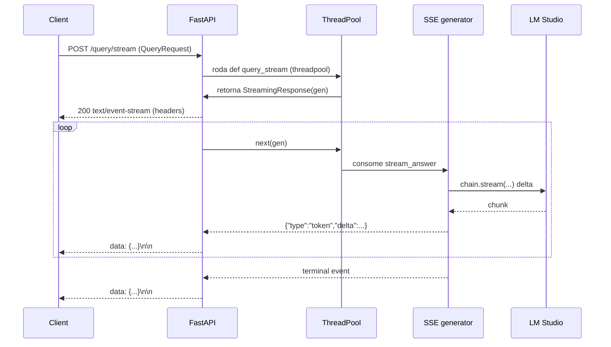
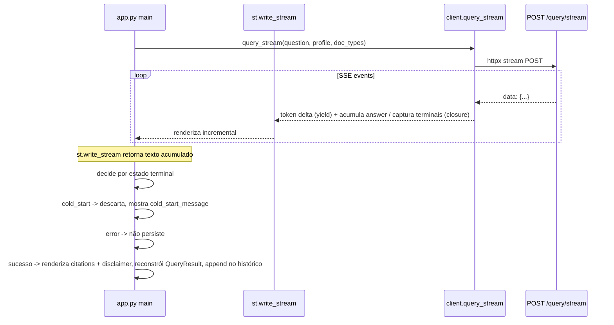

# RAG-05 — Streaming de respostas via SSE — Design

**Spec:** `.specs/features/rag-05-streaming-sse/spec.md`
**Status:** Awaiting human approval

---

## Architecture Overview

RAG-05 adiciona um endpoint dedicado **`POST /query/stream`** que entrega a resposta do LLM via **SSE**, e um caminho de UI que consome esse stream com `st.write_stream`. O streaming é **orquestrado no backend** da seguinte forma: a lógica protocolo-agnóstica (retrieval, cold start, citações, perfil, geração por `LCEL.stream()`) vive em **`generation/chain.py`** (`stream_answer`); o **endpoint** em `api/routers/query.py` converte isso em eventos SSE tipados; a **UI** em `ui/client.py`/`ui/app.py` consome e renderiza.

A feature é **off por padrão** (`generation_streaming_enabled=False`): quando off, `/query/stream` responde 404 e `/query` permanece byte-identical. Quando on, preserva todas as invariantes de segurança (cold start, citações, disclaimer, perfil, doc_types, rate limit).

```mermaid
graph TD
    U[UI app.py] -->|settings.generation_streaming_enabled?| C1[client.query_stream httpx stream]
    C1 -->|POST /query/stream| R[/api/routers/query.py def query_stream/]
    R -->|StreamingResponse text/event-stream| G[SSE wrapper generator]
    G --> S[chain.stream_answer stores, profile, settings, doc_types]
    S --> RET[build_retriever select_collections docs]
    RET -->|docs vazio| CS[return [], cold_start=True]
    RET -->|docs ok| CIT[build_citations + context]
    CIT --> LLM[prompt | ChatOpenAI perfil | StrOutputParser .stream]
    LLM -->|yield delta| G
    LLM -->|acumula resposta| VAL[validate_citations]
    VAL -->|válidas| OK[return citations, False]
    VAL -->|inválidas| CS2[return [], True]
    G --> SSE1[tokens]
    G -->|retorno do gerador| SSE2[citations/disclaimer/done OU cold_start/disclaimer/done OU error]
    SSE1 --> UI
    SSE2 --> UI[st.write_stream + render terminais]
```

### Fluxo por camada

| Camada | Responsabilidade |
|--------|------------------|
| `generation/chain.py` | `stream_answer(...) -> Generator[str, None, tuple[list[CitationItem], bool]]` — decide cold start pré-stream, gera deltas via `LCEL.stream()`, valida citações ao final e retorna `(citations, is_cold_start)`. Nada sabe de SSE. |
| `api/schemas.py` | Helpers de serialização SSE (montam a string `data: {...}\n\n`) reusando `CitationResponse.from_item`. |
| `api/routers/query.py` | `def query_stream(request, body)` → guard 404 se off → `StreamingResponse(gen, media_type="text/event-stream")`; wrapper SSE consome `stream_answer`, emite tokens/terminais, trata erro a meio e desconexão. `@limiter.limit("10/minute")`. |
| `api/main.py` | Lifespan constrói `app.state.streaming_chains[profile]` (closures de `build_stream_chain`) — análogo a `app.state.chains`. |
| `ui/client.py` | `StreamEvent` (dataclass) + `query_stream(...)` — `httpx.Client.stream` e parse de linhas `data:`. |
| `ui/app.py` | Gerador filtrado para `st.write_stream` (acumula resposta e captura terminais via closure); ao concluir, decide persistir/discartar e reconstrui `QueryResult`. |

---

## Sync-Route + Threadpool Model

- `query_stream` é uma rota **`def`** (não `async def`), retornando `StreamingResponse`. FastAPI/Starlette roda rotas `def` num threadpool e, para `StreamingResponse`, **itera o gerador síncrono num thread de trabalho**, liberando o event loop.
- Isso é coerente com **L-004 / FIX-02** (endpoint síncrono de propósito — retriever/ChromaDB/LLM são síncronos). NÃO se usa `ainvoke`/async.
- O gerador síncrono chama `chain.stream()` (LCEL sync) que faz a chamada HTTP ao LM Studio; o bloqueio fica no threadpool, sem travar o event loop (mitiga **H4**).



---

## Streaming + Citation-Validation Flow

1. `stream_answer` recupera `docs = retriever.invoke(question)` (retriever sobre `select_collections(stores, doc_types)`).
2. **Cold start pré-stream**: se `not docs` → `return` (sem yield) com `([], True)` — LLM nunca chamado (RQ-05-07).
3. Normal: `citations = build_citations(docs)`, `context = _format_context(docs)`, `llm = ChatOpenAI(...)` via `get_profile_config(profile, settings)` e `PromptRegistry.get_prompt(profile)` (RQ-05-03).
4. `chain = prompt | llm | StrOutputParser()`; para cada chunk de `chain.stream({context, question})`: **acumula** em `full` e **yield** o chunk (RQ-05-01).
5. Ao final: `answer, valid = validate_citations(full, citations)`; se `valid` → `return (valid, False)`; senão → `return ([], True)` (RQ-05-02/08).
6. O wrapper SSE de `query.py` converte: cada delta → `token`; ao ler o retorno do gerador, `is_cold_start=True` → `cold_start` + `disclaimer` + `done`; senão → `citations` + `disclaimer` + `done`.

### Erro a meio (RQ-05-09)

`chain.stream()` lança (LM Studio indisponível/timeout) → a exceção propaga do `stream_answer`; o wrapper SSE captura em `try/except`, loga `logger.exception` e emite `{"type":"error","message":...}` (terminal, **sem** `done`). Nada é emitido após `error`.

### Desconexão (RQ-05-10)

A cada iteração do wrapper: `if await request.is_disconnected(): return` — interrompe o gerador (Starlette para de chamar `next`), sem emitir terminais. O `finally` do gerador fecha o context manager do stream.

---

## Disconnect / Rate-Limit Handling

| Cenário | Mecanismo | Comportamento |
|---------|-----------|---------------|
| Rate limit | `@limiter.limit("10/minute")` no `def query_stream` (counter separado, Q3) | `RateLimitExceeded` → handler global → **429 JSON antes de qualquer byte SSE** (RQ-05-11) |
| Desconexão | `request.is_disconnected()` no loop do wrapper | Interrompe o gerador sem terminais; `finally` limpa recursos (RQ-05-10) |
| Erro do LLM a meio | `try/except` no wrapper | `{"type":"error"}` terminal, sem `done` (RQ-05-09) |
| Desabilitado | Guard `if not settings.generation_streaming_enabled: raise HTTPException(404)` | 404 antes de ler body/gerador (RQ-05-06) |

---

## UI Data Flow



- `query_stream` usa `httpx.Client.stream("POST", url, json=payload)`; itera `response.iter_lines()`; parseia `data: {...}` em `StreamEvent`; 429 → `RateLimitError`, 5xx → `ServerError` (reusando as exceções existentes).
- No `app.py`, um **gerador de deltas** (que internamente acumula `answer` e captura `citations`/`disclaimer`/`is_cold_start`/`error` em variáveis de closure) é passado a `st.write_stream`. Como `st.write_stream` espera strings, o gerador só `yield` os `delta` dos eventos `token`. Terminais (`citations`/`disclaimer`/`cold_start`/`error`) são consumidos no mesmo loop e guardados no closure.
- Após `st.write_stream` retornar, `app.py` usa o estado terminal capturado: `error` → não persiste (chama `_handle_error`-like); `cold_start` → descarta o texto streamado, `st.warning(cold_start_message)` + `st.info(disclaimer)`; sucesso → `st.expander("Fontes consultadas")` + `st.caption(disclaimer)` e append de `QueryResult(answer, citations, profile, disclaimer, is_cold_start=False)` no histórico (RQ-05-05/08/09).
- **Fallback flag divergente:** se a UI assume streaming on mas o backend responde 404 (backend off), `query_stream` levanta e o fluxo cai no tratamento de erro existente (sem persistir parcial) — comportamento seguro documentado.

---

## Code Reuse Analysis

### Existing Components to Leverage

| Component | Location | How to Use |
|-----------|----------|------------|
| `run_query` (retrieval/cold start/citações/perfil) | `src/medasist/generation/chain.py` | `stream_answer` espelha os passos 1–4 e 6 de `run_query`, trocando `.invoke()` por `.stream()` e o retorno por retorno de gerador |
| `build_retriever` / `select_collections` | `src/medasist/retrieval/retriever.py` | Reusados para respeitar `doc_types` (RQ-05-04) |
| `build_citations` / `validate_citations` | `src/medasist/generation/citations.py` | Reusados verbatim no pós-stream (RQ-05-02/08) |
| `get_profile_config` / `PromptRegistry` | `src/medasist/profiles/schemas.py`, `generation/prompts.py` | Reusados para perfil (RQ-05-03) |
| `CitationResponse.from_item` | `src/medasist/api/schemas.py` | Reusado na serialização do evento `citations` |
| `limiter` / `_rate_limit_exceeded_handler` | `src/medasist/api/deps.py`, `api/main.py` | Decorator `@limiter.limit` no novo endpoint (Q3) |
| Exceções de UI (`RateLimitError`, `ServerError`, etc.) | `src/medasist/ui/client.py` | Reusadas pelo `query_stream` |
| `_render_response` / `_format_citation` | `src/medasist/ui/app.py` | Reusadas para renderizar terminais e citações no fim do stream |
| `build_chain` closure pattern | `src/medasist/generation/chain.py:180` | `build_stream_chain` espelha o padrão de closure para o lifespan |

### Integration Points

| System | Integration Method |
|--------|--------------------|
| Starlette `StreamingResponse` | Rota `def` retorna `StreamingResponse(gen, media_type="text/event-stream")`; gerador síncrono iterado no threadpool |
| LM Studio (LLM) | `ChatOpenAI(...)` com `chain.stream({context, question})` — deltas incrementais |
| Streamlit `st.write_stream` | Recebe gerador de strings (deltas); retorna o texto acumulado |
| httpx `Client.stream` | UI lê `iter_lines()` e parseia `data:` em `StreamEvent` |

---

## Components

### `src/medasist/generation/chain.py` (modify)

- **Purpose**: Gerar a resposta do LLM incrementalmente, preservando cold start/citações/perfil/doc_types; protocolo-agnóstico (não sabe de SSE).
- **Location**: `src/medasist/generation/chain.py`
- **Interfaces**:
  - `stream_answer(question, stores, profile, settings=None, doc_types=None) -> Generator[str, None, tuple[list[CitationItem], bool]]` — yield deltas; retorno `(valid_citations, is_cold_start)`.
  - `build_stream_chain(stores, profile, settings=None) -> Callable[[str, list[DocType] | None], Generator[...]]` — retorna closure `stream(question, doc_types=None)` (espelho de `build_chain`).
- **Dependencies**: `Settings`, `ChatOpenAI`, `build_retriever`, `select_collections`, `build_citations`, `validate_citations`, `get_profile_config`, `PromptRegistry`.
- **Reuses**: a estrutura de `run_query` (mesmos imports, sem novo ciclo de import).

### `src/medasist/api/schemas.py` (modify)

- **Purpose**: Montar a string de cada evento SSE a partir de payloads tipados.
- **Location**: `src/medasist/api/schemas.py`
- **Interfaces** (helpers module-level ou `@classmethod`):
  - `sse_token(delta: str) -> str`
  - `sse_citations(items: list[CitationResponse]) -> str` (usa `CitationResponse.from_item` no chamador)
  - `sse_disclaimer(text: str) -> str`
  - `sse_cold_start(message: str) -> str`
  - `sse_error(message: str) -> str`
  - `sse_done() -> str`
  - Cada um retorna `"data: " + json.dumps({...}, ensure_ascii=False) + "\n\n"`.
- **Dependencies**: `json`, `CitationResponse`.
- **Reuses**: `CitationResponse` / `CitationResponse.from_item`.

### `src/medasist/api/routers/query.py` (modify)

- **Purpose**: Expor `POST /query/stream` com SSE, guard 404, desconexão, erro e rate limit.
- **Location**: `src/medasist/api/routers/query.py`
- **Interfaces**:
  - `query_stream(request: Request, body: Annotated[QueryRequest, Body()]) -> StreamingResponse` (`def`, `@limiter.limit("10/minute")`).
  - `_stream_events(request, body, stream) -> Generator[str, None, None]` (privado) — wrapper SSE: tokens + terminais + `try/except` de erro + checagem de desconexão.
- **Dependencies**: `StreamingResponse`, `Request`, `QueryRequest`, `limiter`, helpers SSE, `stream` closure de `app.state.streaming_chains`.
- **Reuses**: `request.app.state.streaming_chains` (análogo a `app.state.chains`).

### `src/medasist/api/main.py` (modify)

- **Purpose**: Construir `app.state.streaming_chains` no lifespan (uma por `UserProfile`).
- **Location**: `src/medasist/api/main.py` (dentro do `lifespan`)
- **Interfaces**: `app.state.streaming_chains = {profile: build_stream_chain(stores, profile, settings) for profile in UserProfile}`.
- **Reuses**: `build_stream_chain`, `stores` já construído, `UserProfile`.

### `src/medasist/ui/client.py` (modify)

- **Purpose**: Consumir o SSE e expor eventos tipados.
- **Location**: `src/medasist/ui/client.py`
- **Interfaces**:
  - `@dataclass(frozen=True) class StreamEvent: type: str; delta: str | None = None; citations: list[CitationResult] | None = None; message: str | None = None`.
  - `query_stream(question, profile, doc_types=None, base_url=None, timeout=DEFAULT_TIMEOUT) -> Generator[StreamEvent, None, None]` — `httpx.Client.stream("POST", ...)`, `iter_lines()`, parse `data:`; 429→`RateLimitError`, 5xx→`ServerError`.
- **Reuses**: `CitationResult`, exceções existentes.

### `src/medasist/ui/app.py` (modify)

- **Purpose**: Renderizar incrementalmente e persistir/descartar conforme o estado terminal.
- **Location**: `src/medasist/ui/app.py`
- **Interfaces**: `_stream_answer(...)` (privado) ou lógica dentro de `main()` quando `settings.generation_streaming_enabled`.
- **Reuses**: `_render_response`/`_format_citation`/`_handle_error`; `QueryResult` reconstruction.

---

## Data Models

### Settings (config.py) — nova

```python
# Generation
generation_streaming_enabled: bool = Field(default=False)
```

**Relationships**: lida por `api/routers/query.py` (guard 404) e `ui/app.py` (escolha do caminho de renderização). Sem migração de banco.

### StreamEvent (ui/client.py) — nova

```python
@dataclass(frozen=True)
class StreamEvent:
    type: str                    # token | citations | disclaimer | cold_start | error | done
    delta: str | None = None
    citations: list[CitationResult] | None = None
    message: str | None = None
```

---

## Error Handling Strategy

| Error Scenario | Handling | User Impact |
|----------------|----------|-------------|
| LM Studio falha a meio do `.stream()` | Wrapper SSE captura, `logger.exception`, emite `{"type":"error"}` terminal (sem `done`) | UI descarta parcial; nenhum texto persistido (RQ-05-09) |
| Retrieval vazio (cold start) | `stream_answer` retorna antes de qualquer delta, sem LLM | `cold_start` + `disclaimer` + `done` (RQ-05-07) |
| Resposta sem citação válida | `validate_citations` → retorna `([], True)` | `cold_start` terminal; UI descarta texto streamado (RQ-05-08) |
| Desconexão | `request.is_disconnected()` interrompe o gerador | Nenhum terminal; recursos liberados no `finally` (RQ-05-10) |
| Rate limit | `@limiter.limit` → 429 global antes de bytes SSE | Usuário vê 429 padrão (RQ-05-11) |
| Desabilitado | Guard 404 no handler | 404 antes de qualquer geração (RQ-05-06) |
| Body inválido / `""` | `QueryRequest` (pydantic) | 422 igual ao `/query` (RQ-05-12) |

---

## Tech Decisions (only non-obvious ones)

| Decision | Choice | Rationale |
|----------|--------|-----------|
| Q1 Endpoint | `POST /query/stream` dedicado, mesmo `QueryRequest` | `/query` fica byte-identical quando off (RQ-05-06) |
| Q2 Execução | Rota `def` + `StreamingResponse` com gerador **síncrono** no threadpool | Precedente L-004/FIX-02; retriever/ChromaDB/LLM síncronos; não bloqueia event loop (mitiga H4) |
| Q3 Rate limit | Counter separado, `10/minute` | Streaming longo não consome orçamento do `/query`; 429 antes de bytes SSE |
| Q4 Desconexão | `request.is_disconnected()` no loop | Simples e testável; interrompe trabalho fantasma |
| Q5 Validação | Reusar `QueryRequest` sem alteração | Idêntico ao `/query`; preserva byte-identical |
| Q6 Heartbeat | Não incluído no MVP | Deltas fluem dentro de `llm_request_timeout` |
| Citações | `validate_citations` roda **após** acumular a resposta completa | Igual ao `run_query`; evita decidir citação em texto parcial |
| Separação de concern | `chain.py` protocolo-agnóstico; SSE só em `api/` | `stream_answer` testável sem SSE; SSE testável no endpoint |

---

## Mitigations for CONCERNS.md Items

- **H4 (sync-in-async bloqueia event loop):** rota `def` + `StreamingResponse` síncrono no threadpool — o bloqueio do LM Studio fica fora do event loop (Q2; alinhado a L-004).
- **H6 (doc_types silenciosamente ignorado):** `stream_answer` usa `select_collections(stores, doc_types)` antes de qualquer token (RQ-05-04) — mesmo caminho do `run_query` (já resolvido por AD-004).
- **L4 (settings singleton nunca resetado):** testes do novo setting usam `Settings` instanciada com env, não `get_settings()` mutado.
- **L1 (coverage gap — `api/schemas.py`/`api/deps.py`):** o novo endpoint exercita 422, 429 e SSE via `TestClient`, reduzindo lacunas conhecidas (429 testado em RQ-05-11).
- **L6 (sem retry em LM Studio):** o streaming herda `llm_max_retries`/`llm_request_timeout` do `ChatOpenAI`; falha após retries → `error` terminal (RQ-05-09).

---

## Open Questions

None — Q1–Q6 resolvidas e registradas em `spec.md`.
